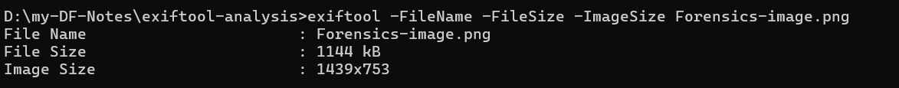
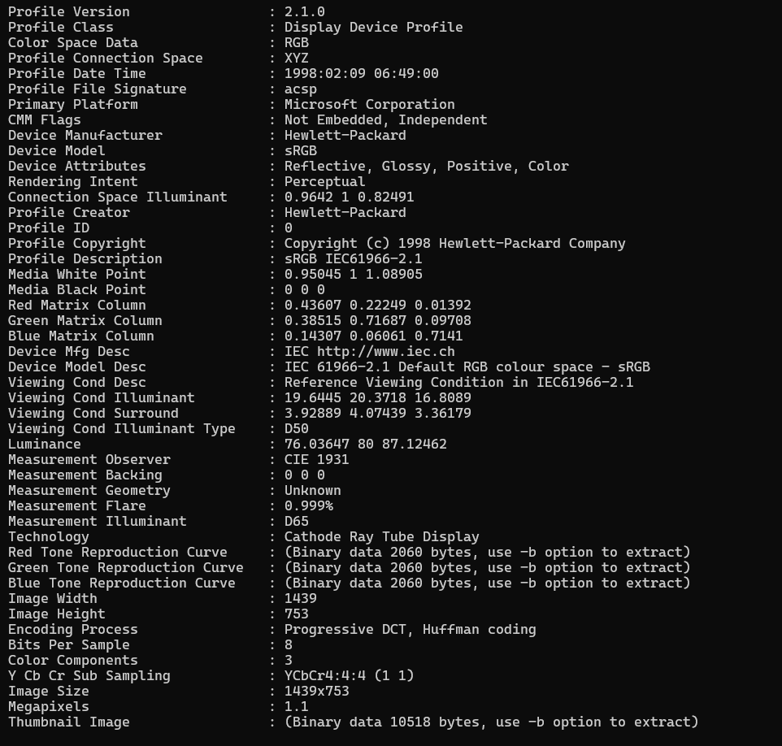
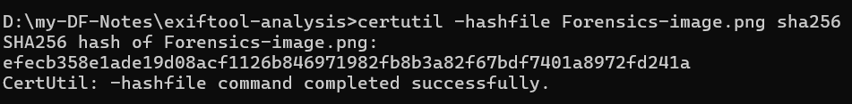

# ExifTool Metadata Analysis Report

## 🔎 Image Overview
- **Filename:** Forensics-image.png
- **File Size:** 1144 kB
- **Image Dimensions:** 1439 x 753

## 📸 Camera Info
- **Make:** NA
- **Model:** NA

## 🌍 Geolocation (If Available)
- **GPS Lat/Long:** NA
- **Maps Link:** NA

## 🕐 Timestamps
- **DateTimeOriginal:** NA
- **ModifyDate:** 2021:04:21 11:06:39

## 📝 Software/Comments
- **Editing Software:** NA
- **Comment Field:** NA

## 🔐 SHA256 Hash
- efecb358e1ade19d08acf1126b846971982fb8b3a82f67bdf7401a8972fd241a

## 🧠 Inference
The image is likely not an original camera photo.
Missing Make and Model fields → No direct camera information.
Missing DateTimeOriginal but present ModifyDate → Suggests editing or file re-saving.
Software tag shows GIMP 2.10.24 → Indicates image was processed or created in an editor.
No GPS coordinates embedded → Either removed or never recorded.

## 🖼️ Screenshots
> Add snippets of your terminal commands and outputs here:
>
> 
> 

---

### Repro steps (copy/paste)
```bash
# All metadata
exiftool Forensics-image.png

# Detailed saved dump + JSON (optional)
exiftool -G1 -a -s Forensics-image.png > exif_full.txt
exiftool -j Forensics-image.png > exif.json

# Fields required for the report
exiftool -FileName -FileSize -ImageSize Forensics-image.png
exiftool -Make -Model Forensics-image.png
exiftool -n -GPSLatitude -GPSLongitude Forensics-image.png
exiftool -DateTimeOriginal -ModifyDate Forensics-image.png
exiftool -Software -Comment Forensics-image.png

# Windows SHA256 (file)
certutil -hashfile Forensics-image.png sha256

# Optional: image-data-only hash via ExifTool
exiftool -api ImageHashType=SHA256 -ImageDataHash Forensics-image.png
```
