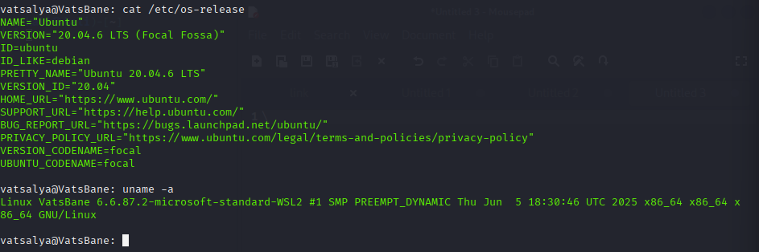

# Reverse Shell (Villain) — Lab Report

> **Legal & Ethical Notice:** This exercise must be performed **only** on systems you own or have explicit written permission to test, and strictly inside an isolated lab (VMs, host-only networks). No production networks. Document consent if applicable.

## 🧭 Lab Overview
Lab Overview

-Goal: Understand C2/reverse-shell concepts using Villain framework and analyze detection opportunities in a controlled environment.
-Tools: Villain C2 framework, Python 3, Kali Linux (attacker), Ubuntu 20.04.6 LTS (victim).
-Network: Isolated host-only network with proper VM snapshots taken before testing.

## 🧪 Environment
-Attacker VM: Kali Linux (192.168.56.255) - lab-only isolated network
-Victim VM: Ubuntu 20.04.6 LTS "Focal Fossa" (192.168.56.1) - lab-only isolated network
-Hardening/EDR present: Standard Ubuntu installation, no additional EDR
-Time of test: 8/14/2025 2:13 PM

## 🔄 High-Level Procedure (no weaponization details)
1.C2 Setup: Started Villain framework on attacker VM with core server listening on port 65001 and Hoaxshell engine on port 8080
2.Payload Generation: Generated Linux-specific payload targeting lab victim IP (192.168.56.101) on port 4444
3.Session Establishment: Successfully established reverse shell session from victim to attacker
4.Session Management: Verified active session with session ID 4cbeeda7-06b4a350-ee21dee0
5.System Reconnaissance: Conducted basic system enumeration to understand victim environment
6.Network Analysis: Observed network connections and interface configurations

## 🧰 Detection & Defense Notes
- **Host Indicators:** _e.g., process tree, parent-child anomalies, command-line args_.
- **Windows/Sysmon Events:** _e.g., 1 (Process Create), 3 (Network), 10 (Process Access)_.
- **Network Indicators:** _e.g., unusual outbound connections, DNS_.
- **Mitigations:** _e.g., application control, firewall egress rules, EDR policies_.
🖥️ Captured Info

-Hostname: VatsBane
-IP Address: 192.168.56.1 (eth0), 127.0.0.1 (loopback)
-User: vatsalya@VatsBane

## Enumeration Performed
hostname
whoami
id
ip addr show
cat /etc/os-release
uname -a
ls
dir

## 🧠 Inference
_Short takeaways on risks, detection opportunities, and controls._
Key Risks Identified:

-Reverse shells bypass traditional perimeter defenses by establishing outbound connections that appear as normal egress traffic
-Once established, attackers gain immediate access to system reconnaissance capabilities, revealing critical infrastructure details
-The multi-stage C2 framework (Villain) demonstrates how modern threats use sophisticated command and control mechanisms that can evade basic detection

Detection Opportunities:

-Network Anomalies: Persistent outbound connections to unusual ports (4444) and IP addresses outside normal business traffic patterns
-Command Patterns: Rapid sequential execution of reconnaissance commands (hostname, whoami, id, ip addr show) indicates automated or scripted enumeration
-Process Behavior: Shells spawned from network connections rather than legitimate user sessions create detectable parent-child process anomalies
-Baseline Deviations: Sudden increase in system information queries and directory listings from standard user accounts

Recommended Controls:

-Command Line Monitoring: Deploy auditd or similar tools to log and alert on suspicious command sequences
-Network Baseline Monitoring: Establish normal traffic patterns to quickly identify anomalous outbound connections
-User Behavior Analytics: Monitor for unusual patterns in user command execution and system access
## 🖼️ Screenshots
> Add only lab screenshots (redact hostnames/IPs if needed):
>
> 
> 
> 
> 
> 
> 
> 
## 🧹 Cleanup

**Snapshot Restoration:**
- Reverted both attacker (Kali Linux) and victim (Ubuntu 20.04.6 LTS) VMs to pre-testing snapshots
- Verified VM states returned to baseline configuration with clean network interfaces
- Confirmed no residual network connections or processes from testing session

**Persistence Verification:**
- **Network Connections:** Verified no lingering TCP connections on ports 4444, 8080, or 65001
- **Process Tree:** Confirmed no background processes related to Villain framework or reverse shell sessions
- **File System:** Validated no temporary files, payloads, or artifacts remain in user directories
- **Network Configuration:** Ensured network interfaces returned to original state with no unusual routing or connection remnants

**Lab Environment Status:**
- Host-only network isolation maintained throughout cleanup process
- No production systems were accessed or affected during testing or cleanup
- VM snapshots confirmed to be in clean state for future testing iterations
- All generated payloads and session artifacts contained within reverted snapshots

**Documentation Verification:**
- All screenshots and logs captured during testing session preserved for analysis
- Sensitive information (IP addresses, hostnames) confirmed to be lab-only test environment data
- No real infrastructure details exposed in documentation
- Testing methodology documented for reproducibility in future controlled lab exercises

**Final State Confirmation:**
- Lab environment successfully restored to baseline configuration
- No persistent access mechanisms remain active
- All testing artifacts contained within documented lab boundaries
- Environment ready for future defensive security research activities
