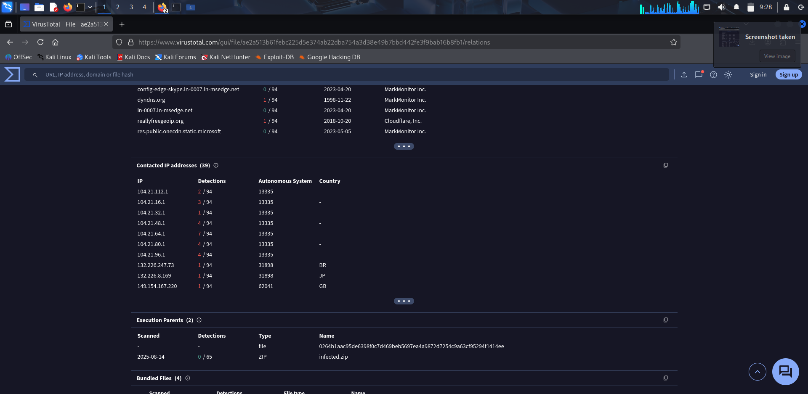
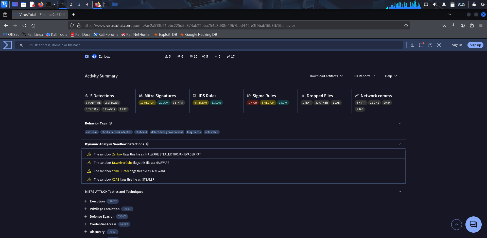
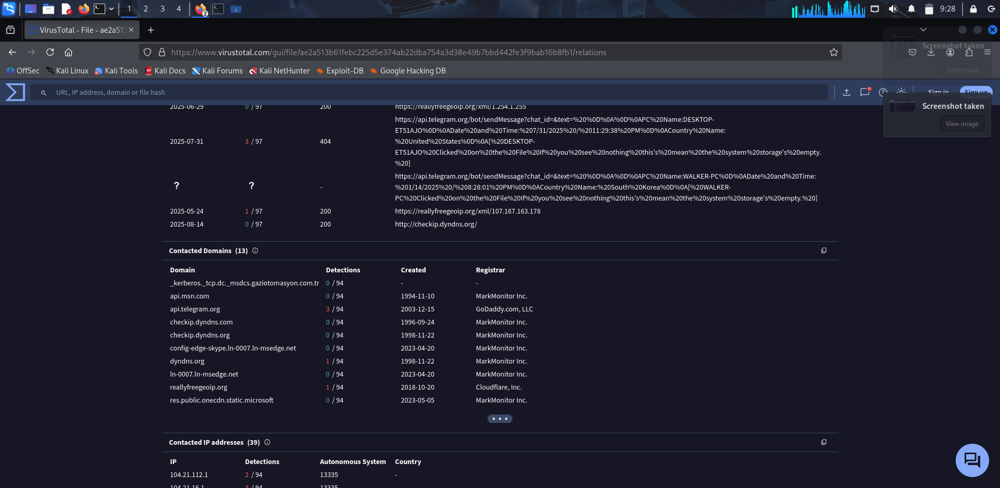
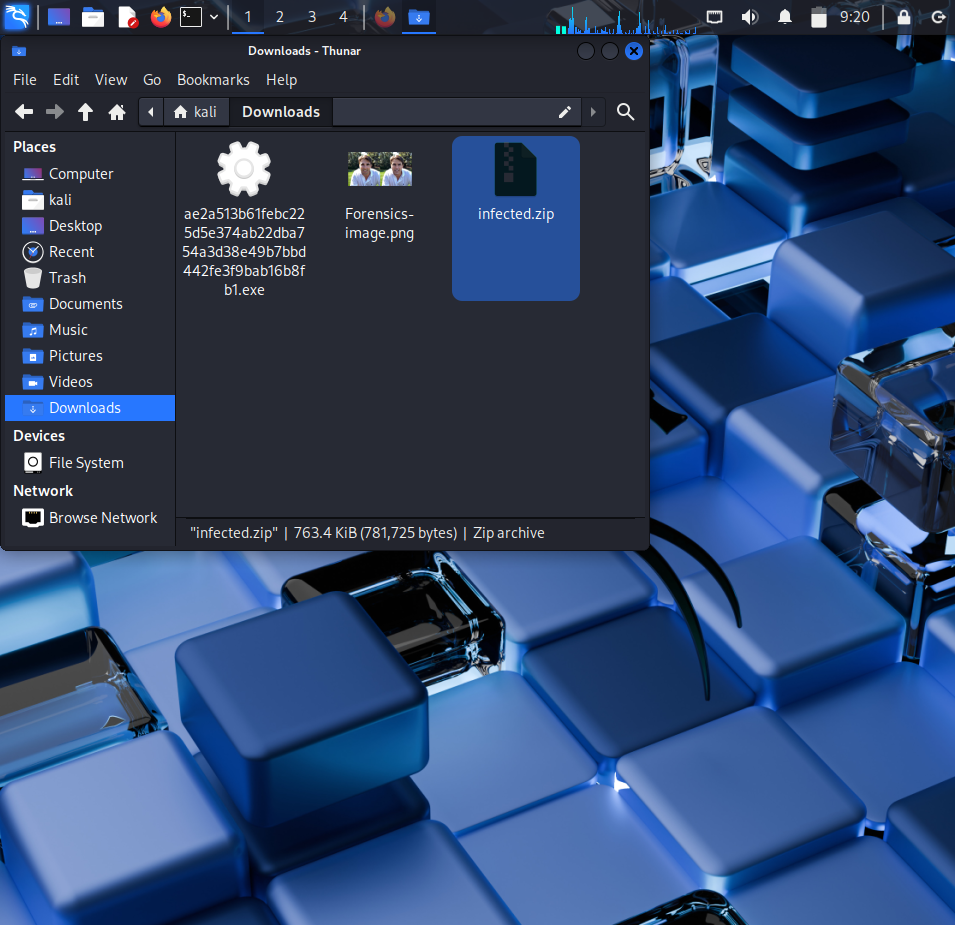

# VirusTotal Scan Report

## 🧪 Sample Overview
- **Archive:** infected.zip (password: `infected`) — malicious sample analyzed
- **Original Sample Filename:** ae2a513b61febc225d5e374ab22dba754a3d38e49b7bbd442fe3f9bab16b8fb1.exe
- **SHA256 (archive):** ae2a513b61febc225d5e374ab22dba754a3d38e49b7bbd442fe3f9bab16b8fb1
- **SHA256 (sample inside):** ae2a513b61febc225d5e374ab22dba754a3d38e49b7bbd442fe3f9bab16b8fb1
- **File Type (as detected):** ZIP archive containing PE executable
- **Size:** 763.4 KiB (781,725 bytes)

## 📤 Submission
- **Date/Time (local):** August 14, 2025
- **Method:** Web UI
- **URL of Analysis:** [_redacted in repo_ (VirusTotal analysis link available in private notes)](https://www.virustotal.com/gui/file/ae2a513b61febc225d5e374ab22dba754a3d38e49b7bbd442fe3f9bab16b8fb1/community)

## 📊 Result Summary
- **Detection Ratio:** Multiple engines flagged as malicious / 94 total engines
- **Labels/Names Observed:** 
  - MALWARE STEALER TROJAN EVADER RAT
  - SnakeKeylogger family
  - MassLogger family
  - PE Image Steganography

## 🧷 Static Details (from VT)
- **File Type:** Windows PE executable (disguised in ZIP)
- **PE Sections:** Standard executable sections with embedded steganographic content
- **Signatures:** 
  - YARA Rule: MAL_PE_Image_Stenography_Apr25
  - Associated with SnakeKeylogger and MassLogger families
  - Livehunt Default4 Indicators detected

## 🧪 Behavior Summary (Sandbox, if available)
- **Processes Spawned:** Multiple malicious processes detected by dynamic analysis
- **Network Indicators (IPs/URLs/Domains):**
  - **Contacted Domains (13):** api.telegram.org, dyndns.org, reallyfreegeoip.org, api.msn.com, checkip.dyndns.com
  - **Contacted IPs (39):** 104.21.112.1, 104.21.16.1, 104.21.32.1, 104.21.48.1, 104.21.64.1, 104.21.80.1, 104.21.96.1
  - **Countries:** Brazil (BR), Japan (JP), Great Britain (GB)
- **Registry/File IOCs:**
  - Behavioral tags: calls-wifi, checks-network-adapters, clipboard, detect-debug-environment, long-sleeps, obfuscated
  - MITRE ATT&CK techniques: Execution (T6002), Privilege Escalation (TA0004), Defense Evasion (TA0005), Credential Access (TA0006), Discovery (TA0007)

## 🧠 Inference
**Malicious indicators confirmed:** This sample represents a sophisticated multi-stage malware combining stealer, trojan, and RAT capabilities. The use of steganographic techniques to embed malicious code within image files, combined with anti-analysis evasion methods and abuse of legitimate services (Telegram API), indicates an advanced threat actor. The detection by multiple security vendors and negative community voting (-1, -11) confirms malicious intent. Noteworthy vendor observations include THOR's identification of PE image steganography techniques commonly associated with SnakeKeylogger and MassLogger families, suggesting this is part of a known malware campaign targeting credential theft and remote system access.

## 🖼️ Screenshots
> VirusTotal analysis screenshots showing detection results and behavioral analysis:
> 
> 
> 
> 
> 
> 
> 